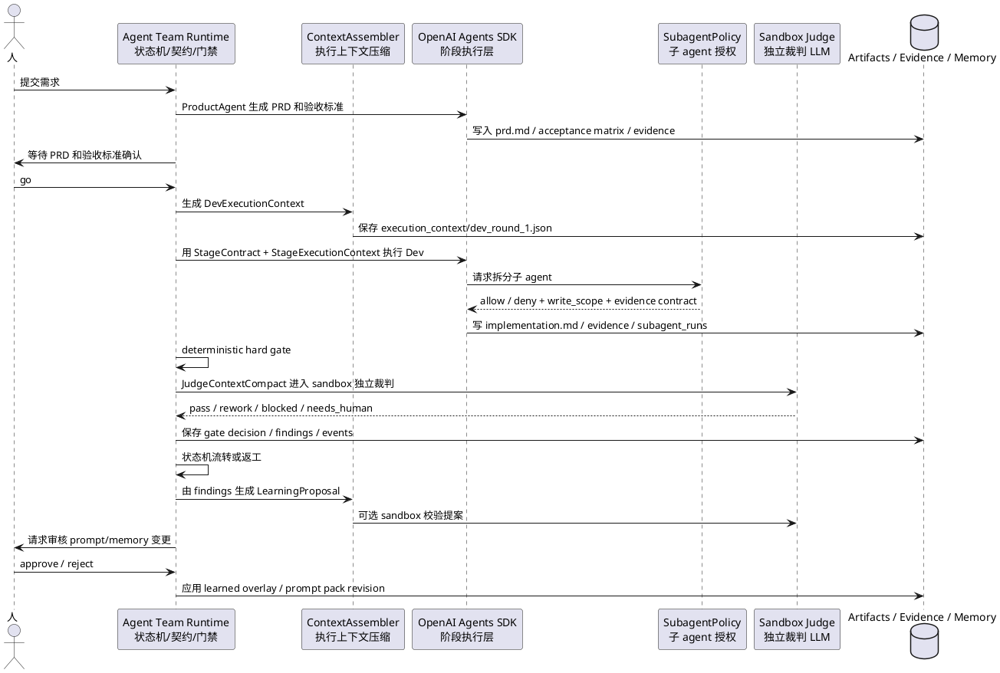
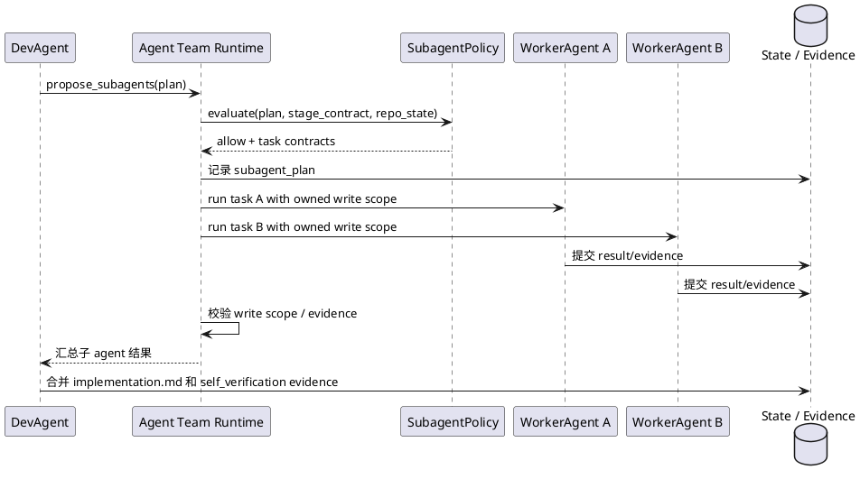
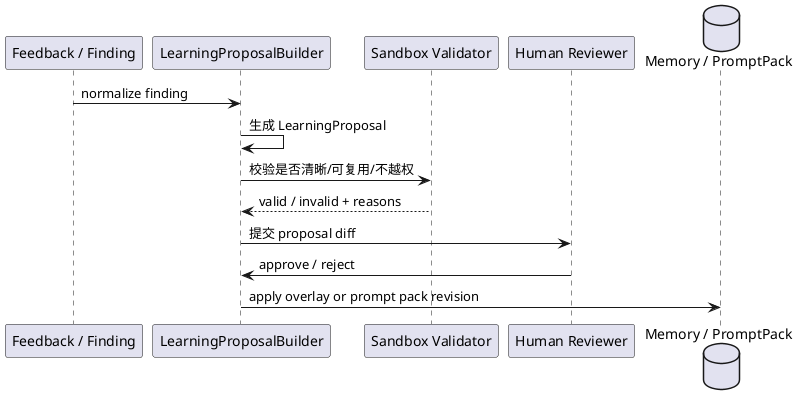

# Agent Team Runtime Agent Context Evolution Design

日期：2026-04-25

## 摘要

这份方案设计 Agent Team 下一阶段的 runtime-first 架构升级。核心结论是：

> Agent Team 的阶段、状态、评判标准、证据门禁、人工卡点继续由自研 runtime 控制；OpenAI Agents SDK 作为默认 agent 执行层，负责阶段内执行、工具调用和受控 specialist/subagent 协作。

这不是把流程交给 agent，而是把 agent 放进更硬的业务 runtime 里执行。

本方案重点覆盖四个问题：

| 问题 | 方案 |
| --- | --- |
| PRD/验收标准确认后，后续 DevAgent 是否应拿到重新整理的上下文 | 新增 `StageExecutionContext`，在人工确认需求后生成稳定、压缩、面向执行的 handoff context |
| Dev 阶段是否允许子 agent | 新增 runtime 控制的 `SubagentPolicy` 和 `SubagentRunRecord`，由 runtime 判断是否允许、如何隔离、如何回收证据 |
| 错误边界和工程化如何做 | 借鉴 Claude Code 的 hook lifecycle、permission pipeline、compaction boundary，建立 Agent Team 自己的 `RuntimeIssue` 和 fail-closed 边界 |
| 如何加入自我进化能力 | 将现有 feedback learning 从“直接写 overlay”升级为 `LearningProposal -> sandbox validation -> human review -> apply` |

## 背景

Agent Team 当前已经具备比较好的 workflow 控制基础：

| 现有模块 | 当前职责 |
| --- | --- |
| `agent_team/stage_machine.py` | 控制 Product、Dev、QA、Acceptance 之间的状态流转 |
| `agent_team/stage_policies.py` | 定义每个 stage 的目标、必需产物、证据要求、failback target |
| `agent_team/stage_contracts.py` | 将 stage policy 编译为 agent 可执行的 `StageContract` |
| `agent_team/gate_evaluator.py` | 先跑 deterministic hard gate，再按需调用独立 judge |
| `agent_team/judge_context.py` | 生成给 judge 使用的压缩上下文 `JudgeContextCompact` |
| `agent_team/openai_sandbox_judge.py` | 通过 OpenAI Agents SDK 在 sandbox 中运行独立裁判 |
| `agent_team/state.py` | 保存 session、stage run、feedback、learning overlay |
| `agent_team/roles.py` | 合并角色基础 context/memory/skill 和 learned overlay |

当前短板是：这些能力主要集中在“裁判和门禁”侧，还没有形成面向“执行 agent”的稳定上下文和受控多 agent 执行层。

## 目标

1. Product 阶段完成并经人确认后，runtime 自动生成面向 Dev 的执行上下文，避免 DevAgent 从零散聊天记录里自己理解需求。
2. Dev 阶段允许使用子 agent，但必须由 runtime 决策、授权和记录，不允许 DevAgent 自由无限拆分。
3. 建立明确错误边界，所有 agent、tool、judge、sandbox、contract 失败都结构化落盘，并默认阻止错误流转。
4. 自我进化能力必须可追责、可审核、可回滚，不允许模型直接修改长期角色行为。
5. 保留 artifact contract。PRD、implementation、QA report、acceptance report、evidence 仍是系统事实来源，不并进 prompt 里。

## 非目标

1. 不把 Agent Team 改成完全由 OpenAI Agents SDK 或 LangGraph 托管的业务流程。
2. 不让 agent 自己决定是否进入下一 stage。
3. 不绕过人工对 PRD 和验收标准的卡控。
4. 不把所有历史聊天原样塞给执行 agent。
5. 不实现无限制后台自优化。

## 参考点

### Agent Team 现有 harness 原则

现有 harness 文档已经明确：

```text
Codex = executor
agent-team = controller
```

这条边界继续保留。后续 OpenAI Agents SDK 也是 executor，不是 controller。

### Claude Code 可借鉴点

本地参考路径：`/Users/zhoukailian/Desktop/mySelf/claude-code`

| Claude Code 能力 | 对 Agent Team 的借鉴方式 |
| --- | --- |
| `ContextProvider` / prompt pipeline | Agent Team 增加 `ContextAssembler`，按 stage 组装稳定上下文 |
| `CompactionService` | 对执行上下文、裁判上下文、子 agent 上下文分别设预算和结构 |
| `HookLifecycle` | 增加 stage/subagent/judge/compact/permission/error lifecycle events |
| `PermissionPipeline` | 对工具、写入范围、危险命令做 runtime 授权 |
| `SubagentStart/Stop` | 子 agent 生命周期显式记录，避免隐式并行 |
| `SessionMemory` / `extractMemories` prompts | 自我进化改成提案和受控写入，而不是随意追加记忆 |

这些是工程模式参考，不建议直接搬 Claude Code 代码。

## 推荐架构



## 分层设计

| 层 | 推荐职责 | 不应承担 |
| --- | --- | --- |
| Workflow Runtime | session、state machine、stage policy、stage contract、gate decision、human gate、rework routing | 写代码、自由探索业务实现 |
| Agent Execution | 运行 Product/Dev/QA/Acceptance agent，调用工具，生成 stage result envelope | 决定流程是否通过、是否跳 stage |
| Context Layer | 生成 stage execution context、judge context、subagent context、learning proposal context | 保留无限聊天历史 |
| Evidence Layer | 保存 artifact、evidence、stage run、subagent run、judge trace | 只把证据藏在自然语言回答里 |
| Learning Layer | 将 feedback/finding 转为可审核 proposal，再应用 overlay | 未审核直接长期改 prompt |

## 一、PRD 确认后的执行上下文

### 问题

当前已有 `JudgeContextCompact`，但它是给裁判看的，目标是判断一个 stage result 是否满足 policy。它不适合直接给 DevAgent 使用。

DevAgent 需要的是：

1. 已批准的需求事实。
2. 可执行的验收标准。
3. 当前 stage 的产物和证据要求。
4. 上一轮 QA/Acceptance/human feedback 的 actionable findings。
5. 仓库相关上下文，但不能无限展开。

### 新增模型：`StageExecutionContext`

建议新增文件：`agent_team/execution_context.py`

```python
@dataclass(slots=True)
class StageExecutionContext:
    session_id: str
    stage: str
    round_index: int
    context_id: str
    contract_id: str
    original_request_summary: str
    approved_prd_summary: str
    acceptance_matrix: list[dict[str, Any]]
    non_goals: list[str]
    constraints: list[str]
    required_outputs: list[str]
    required_evidence: list[str]
    relevant_artifacts: list[ArtifactRef]
    actionable_findings: list[Finding]
    repo_context_summary: str
    role_context_digest: str
    budget: ExecutionContextBudget
```

### 生成时机

| 时机 | 生成内容 |
| --- | --- |
| Product hard gate + judge 通过后 | 可先生成 `ProductApprovedContext` 草稿 |
| 人在 `WaitForCEOApproval` 选择 `go` 后 | 生成正式 `DevExecutionContext` |
| QA failed 或 Acceptance rework 回 Dev | 生成新一轮 `DevExecutionContext`，追加 actionable findings |
| Acceptance rework 回 Product | 生成 `ProductReworkContext`，聚焦需求/验收标准缺口 |

### 输出位置

```text
.agent-team/<session_id>/execution_context/
  product_approved.json
  dev_round_1.json
  dev_round_2.json
  product_rework_round_1.json
```

### 上下文原则

| 内容 | 是否进入执行上下文 |
| --- | --- |
| 已批准 PRD 摘要 | 必须进入 |
| 验收标准矩阵 | 必须进入 |
| stage contract | 必须进入 |
| role context/memory/skill | 进入 digest，不直接全量塞入 |
| 历史聊天 | 不直接进入，只能通过摘要和 artifact refs |
| 文件全文 | 默认不进入，只放 artifact ref、sha256、摘要 |
| 上一轮失败 findings | 必须进入 |
| 用户临时想法但未批准 | 不进入 |

## 二、OpenAI Agents SDK 执行层

### 边界

OpenAI Agents SDK 只作为 agent execution layer。

它可以负责：

1. 运行 ProductAgent / DevAgent / QAAgent / AcceptanceAgent。
2. 处理阶段内 tool calling。
3. 支持 specialist handoff。
4. 输出 structured result。
5. 记录 tracing。

它不能负责：

1. 判断 PRD 是否已经被人批准。
2. 判断 workflow 是否进入下一个 stage。
3. 修改 `WorkflowSummary`。
4. 跳过 hard gate、judge 或 human gate。

### 新增接口：`StageExecutor`

建议新增文件：`agent_team/agents/executor.py`

```python
class StageExecutor(Protocol):
    def run_stage(
        self,
        *,
        contract: StageContract,
        execution_context: StageExecutionContext,
        config: AgentExecutionConfig,
    ) -> StageResultEnvelope:
        raise NotImplementedError
```

默认实现：

```text
OpenAIAgentsStageExecutor
```

保留后续替换空间：

```text
PromptOnlyStageExecutor
LangGraphStageExecutor
CodexStageExecutor
```

### OpenAI 配置

沿用当前 `openai_sandbox_judge.py` 的配置能力：

| 配置 | 用途 |
| --- | --- |
| `api_key` | OpenAI 或中转 API key |
| `base_url` | 兼容 OpenAI API 的中转地址 |
| `proxy_url` | 例如 `http://127.0.0.1:7897` |
| `user_agent` | 默认 `AI-Team-Runtime/0.1` |
| `oa_header` | 中转需要的 `oa` header，默认等于 user agent |

这部分应抽到通用 `OpenAIClientConfig`，judge 和 executor 共用。

## 三、Dev 子 agent 策略

### 原则

DevAgent 可以请求开子 agent，但不能自己最终决定。runtime 必须判断是否允许。

### 新增模型：`SubagentPolicy`

建议新增文件：`agent_team/subagents.py`

```python
@dataclass(slots=True)
class SubagentPolicy:
    stage: str
    max_subagents: int
    require_disjoint_write_scope: bool
    require_task_contract: bool
    allowed_task_kinds: list[str]
    denied_task_kinds: list[str]
    max_context_tokens: int
```

默认策略：

| stage | 策略 |
| --- | --- |
| Product | 默认不允许，除非后续做需求调研 specialist |
| Dev | 允许，但最多 2-3 个，并且必须声明不重叠 write scope |
| QA | 允许 read-only verification 子 agent |
| Acceptance | 默认 read-only，不允许写代码 |

### 决策标准

| 条件 | 允许倾向 |
| --- | --- |
| 任务可按模块拆分 | 允许 |
| 子任务写入文件范围不重叠 | 允许 |
| 子任务有明确产物和验证命令 | 允许 |
| 只是“帮我想想” | 拒绝，留给主 agent |
| 子任务需要同一个核心文件大改 | 拒绝，避免 merge 冲突 |
| 子任务需要破坏性 git 操作 | 拒绝 |
| 子任务缺少验收证据 | 拒绝或要求补 contract |

### 新增模型：`SubagentRunRecord`

```python
@dataclass(slots=True)
class SubagentRunRecord:
    run_id: str
    parent_stage_run_id: str
    name: str
    task_kind: str
    contract: SubagentContract
    state: str
    write_scope: list[str]
    result_summary: str
    evidence: list[EvidenceItem]
    findings: list[Finding]
    created_at: str
    updated_at: str
```

### Dev 子 agent 时序



## 四、错误边界和工程化

### 设计原则

1. 错误必须结构化，不只写在自然语言日志里。
2. 错误默认 fail closed，不允许静默进入下一 stage。
3. agent 错误、tool 错误、judge 错误、contract 错误要区分。
4. 所有 runtime 决策要能从 state 和 events 回放。

### 新增模型：`RuntimeIssue`

建议新增文件：`agent_team/runtime_errors.py`

```python
@dataclass(slots=True)
class RuntimeIssue:
    issue_id: str
    session_id: str
    stage: str
    run_id: str
    kind: str
    severity: str
    message: str
    retryable: bool
    blocks_transition: bool
    evidence: dict[str, Any]
    created_at: str
```

### 错误分类

| kind | 含义 | 默认处理 |
| --- | --- | --- |
| `GateFailure` | hard gate 未通过 | rework 或 blocked |
| `JudgeUnavailable` | sandbox judge / OpenAI 请求失败 | blocked 或 needs_human，不自动 pass |
| `AgentExecutionError` | agent 执行失败 | stage run failed |
| `ToolPermissionError` | 工具权限或危险操作被拒 | blocked，记录权限原因 |
| `ContextOverflow` | context 超预算或压缩失败 | blocked，要求重新 compact |
| `ArtifactContractViolation` | 缺少必需 artifact/evidence | rework |
| `SubagentConflict` | 子 agent 写入范围冲突 | rework 到 Dev |
| `SandboxViolation` | 裁判或子 agent 尝试越权 | blocked |

### Runtime hooks

借鉴 Claude Code 的 hook lifecycle，但先做轻量事件系统：

| Hook | 触发时机 |
| --- | --- |
| `stage_start` | stage run 创建后 |
| `stage_stop` | stage run terminal state |
| `subagent_start` | 子 agent 被授权后 |
| `subagent_stop` | 子 agent 完成或失败 |
| `pre_compact` | 生成 execution/judge/subagent context 前 |
| `post_compact` | context 生成后 |
| `permission_request` | agent 请求高风险工具或写 scope |
| `permission_denied` | runtime 拒绝工具/写入/sandbox 操作 |
| `judge_start` | 独立裁判开始 |
| `judge_stop` | 独立裁判结束 |
| `runtime_error` | 任意 RuntimeIssue 产生 |

第一版不需要插件化 hook runner，只需要统一写 `events.jsonl`，后续再扩展。

## 五、裁判上下文和 sandbox

### 当前状态

当前 sandbox judge 不是 Acceptance 专属。只要执行：

```text
agent-team verify-stage-result --judge openai-sandbox
agent-team judge-stage-result --judge openai-sandbox
```

并且 hard gate 通过，就会把 `JudgeContextCompact` 交给 sandbox 中的新 LLM 判断。

### 设计要求

1. hard gate 永远在 host runtime 执行。
2. judge 永远只读，不修改文件、不修改 state、不执行 git。
3. judge 输入只能是 `JudgeContextCompact`，不是全量聊天。
4. judge 输出只能是结构化 `JudgeResult`。
5. judge 不可用时不能自动 pass。

### JudgeContextCompact 保留

现有 `JudgeContextCompact` 方向正确，建议继续使用，并增加：

| 字段 | 用途 |
| --- | --- |
| `execution_context_ref` | 指向对应 stage 的执行上下文 |
| `subagent_run_refs` | Dev 阶段若使用子 agent，裁判可看到摘要和证据 |
| `runtime_issues` | 当前 stage 内的结构化错误 |
| `policy_version` | 防止 judge 不知道评判标准版本 |

## 六、自我进化机制

### 当前问题

当前 `record_feedback` 会直接调用 `apply_learning`，把 finding 追加到目标角色的：

```text
.agent-team/memory/<Role>/lessons.md
.agent-team/memory/<Role>/context_patch.md
.agent-team/memory/<Role>/skill_patch.md
```

这很实用，但长期看有风险：

1. 人类随手反馈可能过窄。
2. 模型生成的 proposed update 可能污染长期 prompt。
3. 没有版本、审核、回滚。
4. 多次反馈可能相互矛盾。

### 新增流程



### 新增模型：`LearningProposal`

```python
@dataclass(slots=True)
class LearningProposal:
    proposal_id: str
    source_finding_id: str
    target_role: str
    change_type: str
    rationale: str
    proposed_lessons: str
    proposed_context_patch: str
    proposed_skill_patch: str
    affected_prompt_pack: str
    validation_status: str
    human_decision: str
    created_at: str
```

### 内置 prompt pack

建议把角色提示词分成可版本化的包：

```text
agent_team/prompt_packs/
  product.md
  dev.md
  qa.md
  acceptance.md
  judge.md
  learning_proposal.md
```

角色目录 `Product/context.md` 等仍保留，但 runtime 可以额外记录：

```text
prompt_pack_version
learned_overlay_version
```

这样可以实现：

1. 变更可 diff。
2. 变更可回滚。
3. 变更可灰度到某个 role。
4. 评判标准和执行 prompt 分离。

## 七、PRD 和验收标准格式

用户只在 PRD 和验收标准上卡控，所以 Product 输出必须更适合人审。

建议 `prd.md` 固定包含：

| 区块 | 要求 |
| --- | --- |
| 需求摘要 | 5-10 行，说明做什么、不做什么 |
| 用户路径图 | Mermaid 或 PlantUML |
| 页面/能力表 | 用表格列出功能点、输入、输出、边界 |
| 验收矩阵 | 每条标准有 id、场景、操作、期望结果、证据要求 |
| 非目标 | 明确不在本轮做什么 |
| 风险和依赖 | 明确阻塞项 |

验收矩阵示例：

| id | 场景 | 操作 | 期望结果 | 必需证据 |
| --- | --- | --- | --- | --- |
| AC-001 | 用户触发 Agent Team 流程 | 执行 start-session | 创建 session 并进入 Product | session.json、workflow_summary.md |
| AC-002 | PRD 被确认 | record-human-decision go | 生成 DevExecutionContext 并进入 Dev | dev_round_1.json |

## 八、CLI 变化建议

### 新增命令

| 命令 | 用途 |
| --- | --- |
| `build-execution-context` | 为当前 stage 生成执行上下文 |
| `run-stage-agent` | 用 OpenAI Agents SDK 执行当前 stage |
| `propose-subagents` | DevAgent 提交子 agent 拆分请求 |
| `record-subagent-result` | 保存子 agent 结果 |
| `propose-learning` | 从 finding/feedback 生成 learning proposal |
| `review-learning` | 人审 learning proposal |
| `apply-learning-proposal` | 应用已批准的学习提案 |

### 现有命令增强

| 命令 | 增强点 |
| --- | --- |
| `record-human-decision --decision go` | Product go 后自动生成 DevExecutionContext |
| `build-stage-contract` | 输出 execution_context_ref |
| `verify-stage-result` | 写入 judge trace、runtime issues、context refs |
| `record-feedback` | 默认只生成 learning proposal，保留 `--apply-direct` 作为显式危险选项 |

## 九、状态文件布局

建议新增：

```text
.agent-team/<session_id>/
  execution_context/
    dev_round_1.json
    dev_round_2.json
  subagent_runs/
    dev-run-1-subagent-1.json
    dev-run-1-subagent-2.json
  gate_decisions/
    dev-run-1.json
    qa-run-1.json
  runtime_issues/
    issue-*.json
  learning_proposals/
    proposal-*.json
```

已有：

```text
.agent-team/<session_id>/
  session.json
  workflow_summary.md
  stage_runs/
  feedback/
  events.jsonl
```

继续保留。

## 十、落地阶段

### Phase 1：执行上下文

目标：解决 Product 审批后 DevAgent 上下文效率问题。

改动：

1. 新增 `StageExecutionContext`。
2. 新增 `ContextAssembler`。
3. `record-human-decision go` 后自动生成 `dev_round_1.json`。
4. `build-stage-contract` 输出 execution context 路径。

验收：

1. Product go 后可以看到 `execution_context/dev_round_1.json`。
2. Dev contract 引用该 context。
3. context 不包含未批准临时需求。

### Phase 2：OpenAI Agents SDK StageExecutor

目标：让阶段执行走统一 agent execution 接口。

改动：

1. 新增 `StageExecutor` protocol。
2. 新增 `OpenAIAgentsStageExecutor`。
3. 抽取通用 `OpenAIClientConfig`。
4. 支持 base_url、proxy_url、oa header。

验收：

1. DevAgent 可通过 SDK 生成 `StageResultEnvelope`。
2. runtime 仍使用 hard gate + judge 决定是否流转。
3. SDK 执行失败不会进入下一 stage。

### Phase 3：Dev 子 agent

目标：允许 Dev 阶段受控并行。

改动：

1. 新增 `SubagentPolicy`。
2. 新增 `SubagentContract` 和 `SubagentRunRecord`。
3. DevAgent 只能通过 runtime 请求子 agent。
4. 子 agent 结果必须回收到 evidence。

验收：

1. write scope 冲突时拒绝并记录 `SubagentConflict`。
2. 子 agent 缺证据时 Dev stage 不能 pass。
3. Acceptance judge 能看到子 agent 摘要和证据引用。

### Phase 4：错误边界和 hooks

目标：工程化可观测和 fail-closed。

改动：

1. 新增 `RuntimeIssue`。
2. 统一 `events.jsonl` hook event。
3. judge/tool/agent/context 错误都结构化。
4. panel/board 后续可展示 runtime issues。

验收：

1. sandbox judge 不可用时不会自动 pass。
2. artifact 缺失时产生 `ArtifactContractViolation`。
3. tool 越权时产生 `ToolPermissionError`。

### Phase 5：受控自我进化

目标：feedback learning 可审核、可回滚。

改动：

1. 新增 `LearningProposal`。
2. `record-feedback` 默认生成 proposal。
3. 新增 proposal validator。
4. 人审后才写入 learned overlay 或 prompt pack。

验收：

1. 未批准 proposal 不影响角色 prompt。
2. 每次学习变更有 diff、来源 finding、审核记录。
3. 可回滚到上一个 overlay version。

## 十一、关键风险

| 风险 | 缓解 |
| --- | --- |
| 上下文压缩丢失关键需求 | PRD/验收矩阵作为结构化输入，不从聊天摘要推断 |
| 子 agent 并行导致冲突 | runtime 要求 disjoint write scope，冲突直接 fail closed |
| judge 不可用阻塞流程 | 允许 `needs_human`，但不允许自动 pass |
| learning 污染长期 prompt | proposal + validator + human approval + rollback |
| OpenAI SDK 绑定过深 | 保留 `StageExecutor` protocol，可替换实现 |
| 文档和证据漂移 | artifact contract 继续作为事实来源，prompt 只引用 artifact ref |

## 十二、推荐实施切口

第一版不要一次做完整多 agent 和自我进化。建议先做最小闭环：

```text
Product 产出 PRD/验收矩阵
-> 人确认 go
-> Runtime 生成 DevExecutionContext
-> OpenAI Agents SDK 执行 Dev
-> Hard gate
-> Sandbox judge
-> Runtime 决定 pass/rework/blocked
```

这个闭环跑通后，再接 Dev 子 agent 和 learning proposal。

## Spec 自检

| 检查项 | 结果 |
| --- | --- |
| 是否有未决占位项 | 无 |
| 是否把流程控制交给 agent | 否 |
| 是否保留人工 PRD/验收标准卡点 | 是 |
| 是否保留 artifact contract | 是 |
| 是否明确 sandbox judge 边界 | 是 |
| 是否覆盖四个用户提出的问题 | 是 |
| 是否可以拆成实施计划 | 是 |
