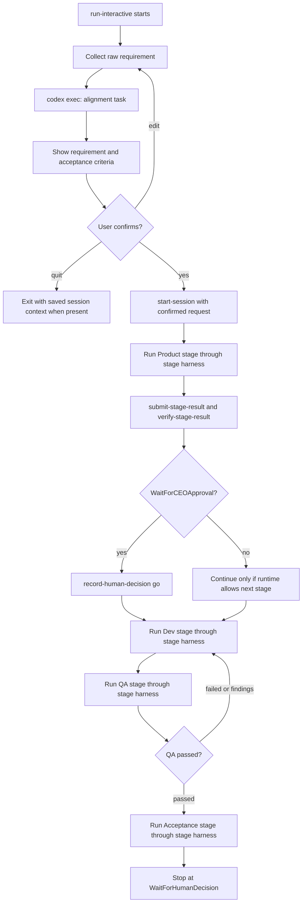

# Agent Team Run Interactive Design

## Summary

Add `agent-team run-interactive` as a terminal harness for the existing Agent Team state machine. The command provides a human-friendly CLI flow for collecting a requirement, aligning the requirement and acceptance criteria through `codex exec`, asking the human to confirm that alignment once, then driving the existing Product, Dev, QA, and Acceptance stages through runtime gates.

The harness must not replace the workflow state machine. It coordinates prompts, `codex exec` calls, stage-run acquisition, stage-result submission, verification, and human decisions using the existing `agent-team` runtime APIs.

## Goals

- Let a user run `agent-team run-interactive` from a repository root and be prompted for the requirement.
- Align the requirement and acceptance criteria before any implementation work starts.
- Require one explicit human confirmation for the requirement and acceptance criteria.
- After confirmation, automatically treat the Product gate as approved once Product submits a verified `prd.md`.
- Execute actual model work through `codex exec`, not through deterministic demo backends.
- Keep Product, Dev, QA, Acceptance, artifacts, stage runs, and verification under the existing Agent Team runtime controls.
- Make each model task small enough to be understandable, auditable, and retryable.

## Non-Goals

- Do not make `agent-team` with no subcommand interactive. The new entrypoint is `agent-team run-interactive`.
- Do not remove `start-session`, `run`, or `agent-run`.
- Do not bypass QA or replace QA with Dev self-verification.
- Do not make the final human Go or No-Go decision automatically.
- Do not implement a full-screen TUI. The first version is line-oriented terminal interaction.

## User Experience

Default interactive flow:

```text
$ agent-team run-interactive

What requirement should Agent Team run?
> Add ...

Aligning requirement and acceptance criteria with Codex...

Requirement understanding:
- ...

Scope boundary:
- In scope: ...
- Out of scope: ...

Acceptance criteria:
1. ...
2. ...
3. ...

Choose:
[y] confirm and continue
[e] edit or add details
[q] quit
>
```

Supported shortcuts:

```bash
agent-team run-interactive --message "执行这个需求：..."
agent-team run-interactive --session-id 20260429T114149367856Z-session
agent-team run-interactive --dry-run
```

The command should print the session id, artifact directory, current stage, and next action after each major transition.

## Confirmation Contract

The only mandatory human confirmation before implementation is the aligned requirement and acceptance criteria.

When the user selects `y`:

1. The harness persists the confirmed alignment into the session artifact directory.
2. The harness runs Product through `codex exec`.
3. Product writes `prd.md` based on the confirmed alignment.
4. Product result is submitted and verified through existing runtime gates.
5. If Product verification advances the workflow to `WaitForCEOApproval`, the harness records a `go` human decision automatically.
6. Dev starts after that automatic Product approval.

When the user selects `e`:

1. The harness asks for additional text.
2. The harness reruns the alignment step with the original request, previous alignment, and new user input.
3. The terminal shows the revised alignment and asks again.

When the user selects `q`:

1. The harness exits without running Product, Dev, QA, or Acceptance.
2. If a session was created, it remains inspectable through `agent-team status`, `agent-team resume`, and `agent-team panel`.

## Architecture

Add a small interactive orchestration layer under `agent_team`.

Proposed modules:

- `agent_team/interactive.py`
  - Owns terminal prompts, user choices, flow control, and high-level orchestration.
- `agent_team/codex_exec.py`
  - Wraps `codex exec` invocation, stdout capture, stderr capture, exit-code handling, and optional JSONL parsing.
- `agent_team/stage_harness.py`
  - Runs one Agent Team stage using existing runtime commands and `codex exec`.
- `agent_team/alignment.py`
  - Defines the requirement alignment prompt, output schema, validation, and persistence.

Existing modules remain authoritative for state:

- `agent_team/state.py`
- `agent_team/stage_machine.py`
- `agent_team/stage_contracts.py`
- `agent_team/execution_context.py`
- `agent_team/cli.py`

## Data Flow



## Codex Exec Contract

The harness invokes `codex exec` as a subprocess.

Baseline command:

```bash
codex exec --cd "$REPO_ROOT" --json --output-last-message "$OUTPUT_FILE" "$PROMPT"
```

The implementation should expose options for:

- `--model`
- `--sandbox`
- `--approval`
- `--profile`
- `--codex-bin`

Defaults:

- `codex-bin`: first `codex` found on `PATH`
- `sandbox`: `workspace-write`
- `approval`: `never` for non-interactive stage execution
- `model`: omit by default so Codex uses the user's configured default

The harness must preserve the full prompt and final model output in the session artifact directory for auditability.

## Alignment Output Shape

The alignment model task must produce strict JSON:

```json
{
  "requirement_understanding": ["..."],
  "scope": {
    "in_scope": ["..."],
    "out_of_scope": ["..."]
  },
  "acceptance_criteria": [
    {
      "id": "AC1",
      "criterion": "...",
      "verification": "..."
    }
  ],
  "clarifying_questions": ["..."]
}
```

Validation rules:

- `requirement_understanding` must contain at least one item.
- `acceptance_criteria` must contain at least one item.
- Each criterion must have `id`, `criterion`, and `verification`.
- If `clarifying_questions` is non-empty, the terminal should show them before confirmation and encourage the user to choose `e`.

## Stage Harness Contract

For each executable stage, the harness performs the same sequence:

1. `agent-team acquire-stage-run --session-id <id> --stage <stage> --worker codex-exec`
2. `agent-team build-execution-context --session-id <id> --stage <stage>`
3. Build a stage-specific `codex exec` prompt from:
   - the execution context JSON
   - confirmed alignment JSON
   - stage contract JSON
   - current repository path
   - required output artifact name
4. Run `codex exec`.
5. Validate the model's final JSON bundle.
6. Write the bundle to the session artifact directory.
7. `agent-team submit-stage-result --session-id <id> --bundle <bundle_path>`
8. `agent-team verify-stage-result --session-id <id>`
9. Read `agent-team step --session-id <id>` and continue only according to runtime state.

## Stage Model Output Bundle

Each stage `codex exec` final response must be valid JSON compatible with `StageResultEnvelope`.

Minimum shape:

```json
{
  "session_id": "...",
  "stage": "Product",
  "contract_id": "...",
  "status": "passed",
  "summary": "...",
  "artifact_name": "prd.md",
  "artifact_content": "...",
  "journal": "...",
  "evidence": [
    {
      "name": "explicit_acceptance_criteria",
      "kind": "report",
      "summary": "..."
    }
  ],
  "findings": []
}
```

Stage-specific requirements:

- Product must write `prd.md` and include the confirmed acceptance criteria.
- Dev must write `implementation.md`, list changed files, commands run, results, limitations, and rework mapping when applicable.
- QA must write `qa_report.md`, independently rerun feasible verification, and mark `passed`, `failed`, or `blocked`.
- Acceptance must write `acceptance_report.md` and recommend `recommended_go`, `recommended_no_go`, or `blocked`.

## Error Handling

- Missing `codex` binary: print install guidance and exit non-zero before creating stage runs.
- `codex exec` non-zero exit: save stdout and stderr, mark the active stage as not submitted, print resume guidance.
- Invalid alignment JSON: show raw output path and ask whether to retry.
- Invalid stage bundle JSON: do not submit; save raw output and print the expected schema.
- Runtime gate failure: stop and print the gate result, session id, and panel command.
- User interrupt: stop cleanly and print `agent-team resume --session-id <id>`.

## Resume Behavior

`agent-team run-interactive --session-id <id>` resumes from runtime state.

- If the session is still in Intake and no confirmed alignment exists, rerun alignment.
- If confirmed alignment exists and Product is pending, run Product.
- If waiting for CEO approval and the Product artifact was generated by this harness from confirmed alignment, record `go`.
- If in Dev, QA, or Acceptance, run the current active stage.
- If waiting for final human decision, print the Acceptance recommendation and ask the user for `go`, `no-go`, or `rework`.

## Safety and Auditability

- Every prompt sent to `codex exec` is saved under `.agent-team/<session_id>/codex_exec/`.
- Every raw model response is saved under `.agent-team/<session_id>/codex_exec/`.
- Every parsed bundle is saved before submission.
- The harness never edits workflow summary files directly.
- The harness never records final Go or No-Go automatically.
- The harness may record Product `go` automatically only after the user confirmed the aligned requirement and acceptance criteria.

## Testing Strategy

Unit tests:

- Parser validates alignment JSON and rejects missing acceptance criteria.
- `run-interactive --message` creates the expected alignment prompt.
- User choice handling maps `y`, `e`, and `q` correctly.
- `CodexExecRunner` builds the expected subprocess command without executing it.
- Stage harness calls runtime operations in the expected order.
- Product auto-approval only happens after a confirmed alignment marker exists.

Integration tests with fake Codex:

- A fake `codex` executable returns alignment JSON, Product bundle JSON, Dev bundle JSON, QA bundle JSON, and Acceptance bundle JSON.
- `agent-team run-interactive --message ...` reaches `WaitForHumanDecision`.
- QA failure routes back to Dev.
- Invalid Product bundle stops before `submit-stage-result`.
- Resume from `WaitForCEOApproval` records Product `go` only for a harness-confirmed session.

Manual smoke test:

```bash
cd /path/to/project
agent-team run-interactive --message "执行这个需求：Add a visible demo change with clear acceptance criteria."
agent-team status
agent-team panel --open-browser
```

## Rollout Plan

1. Add `run-interactive` as an opt-in command.
2. Keep `start-session` behavior unchanged.
3. Update generated `agent-team-run` skill text to recommend `run-interactive` for terminal workflows.
4. Update README or usage docs with the terminal flow.
5. Leave deterministic `run` and `agent-run` labeled as demo commands.

