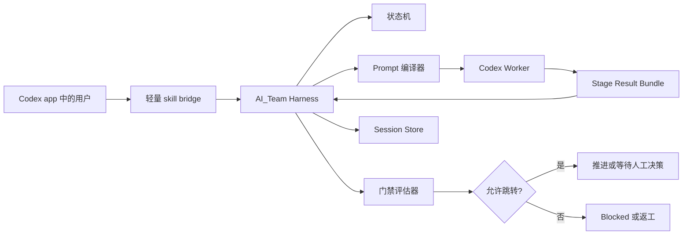

# AI_Team Codex Harness-First 技术方案

日期：2026-04-11

## 摘要

这份方案的目标，是把 AI_Team 从“以 skill 提示词为主的流程”，升级为 `Harness-First` 的执行流程。它运行在 Codex app 之下，角色更像一个执行层 supervisor。

后文中提到的 `Harness-First`，统一指：

- 流程控制权优先属于 harness
- skill 只作为入口和 prompt 素材
- worker 只负责执行单阶段任务

现在仓库里已经有一些可以复用的基础能力：

- 持久化状态存储
- 工作流状态模型
- 角色提示词和产物契约
- 本地初始化和启动脚本

但目前真正的流程控制权仍然在 `SKILL.md` 和当前 Codex 对话里。这会导致运行时不稳定：

- 通用方法论 skill 仍然可能接管流程控制权
- 阶段跳转不是由硬执行层强制约束
- artifact 写入失败后，流程可能退化成临时写仓库文档继续推进
- `Dev -> QA -> Acceptance` 可以被文字描述，但不是运行时强制门禁

建议的方向是：让 `ai_company` 成为真正的 workflow harness。skill 仍然保留，但只作为入口和 prompt 素材。session 状态、阶段归属、门禁、返工路由和人工审批边界，都由 harness 统一控制。

## 目标

- 让 AI_Team 在 Codex app 中稳定执行。
- 把流程控制权从提示词迁移到运行时代码。
- 保留现有状态模型：
  - `Intake -> ProductDraft -> WaitForCEOApproval -> Dev -> QA -> Acceptance -> WaitForHumanDecision`
- 保留基于文件的交接产物。
- 让 `QA` 和 `Acceptance` 成为硬门禁，而不是对话里的约定。
- 防止通用方法论 skill 改变 AI_Team 的阶段顺序。
- 支持 resume、返工、人工决策记录等一等公民能力。
- 尽量复用当前仓库结构，避免重起炉灶。

## 非目标

- 第一阶段不做独立的外部常驻服务。
- 第一阶段不依赖 Codex 必须暴露全新的原生多 agent API。
- 不用自动化结果替代人的 `Go/No-Go` 决策。
- 不移除 skill。skill 仍然负责角色定义和 prompt 素材。
- 第一阶段不做完整 UI 看板或可视化面板。

## 问题背景

当前仓库处在两种架构中间：

1. 一个确定性 CLI demo runtime。
2. 一个在当前 Codex 对话里靠 prompt 推进的工作流。

真正的问题就来自这两者的混合状态。

### 已经暴露出的现象

- runtime bootstrap 命令只创建 session scaffold 和 summary 文件，不拥有后续执行循环。
- skill 文案里写了 workflow isolation contract，但这些规则仍然是提示词约束，不是运行时强约束。
- artifact 写入失败或 stage 状态缺失时，当前 Codex 会话会退回到仓库里的临时文档继续推进。
- 实际会话中，`brainstorming`、`test-driven-development` 这类通用方法论 skill 在 AI_Team 已经开始后仍然被反复触发。
- 实际会话中，`.ai_company_state` 目录写失败后，流程没有由运行时阻断，而是用人工补偿方式继续。

### 根因

当前系统把提示词同时当成了：

- 策略层
- 阶段控制器
- 异常恢复机制

这对一个 skill 文件来说职责太重了。AI_Team 需要一个真正的执行 harness。

## 总体架构

推荐的架构形态是：

- `harness-first`
- `skill-thin`
- `worker-bounded`

### 各层职责

#### 1. Harness

Harness 是唯一事实来源，负责：

- 当前 session 状态
- 当前阶段 owner
- 合法下一跳
- 必需产物
- 门禁判断
- 返工路由
- 人工决策

Harness 可以让 Codex 去执行具体工作，但 Codex 不能自己决定 workflow 状态。

#### 2. Skills

Skills 变成受限的 prompt 素材：

- workflow 入口 skill
- stage role skills
- 可选的方法论 skill

Skill 可以提升阶段执行质量，但不能控制阶段跳转。

#### 3. Worker

Worker 是当前 Codex 会话，或者一个被 spawn 出来的 Codex 子 agent。它一次只执行一个 stage contract。

Worker 可以：

- 读取当前阶段输入
- 修改真实仓库
- 生成 artifact 和 evidence
- 上报 findings

Worker 不可以：

- 自己推进到下一阶段
- 跳过必需阶段
- 把 Dev 自测证据当成 QA 证据
- 宣称整个 workflow 已完成

## 架构图



## 推荐推进策略

### 第一阶段：Codex app 下的 CLI Harness

这是推荐的第一步。

- 继续把 `ai_company` 作为本地可执行入口。
- 把它从 bootstrap-only 扩展成真正的 supervisor。
- Codex app 通过 shell 命令或轻量 bridge 调用 harness。
- 保留当前 skill 包，但把它限制在：
  - 启动 session
  - 加载当前 stage prompt
  - 提交 stage result

这个路径最贴近现有仓库，平台风险最低。

### 第二阶段：Codex-aware Bridge

CLI harness 稳定后，再做更强的 Codex 集成：

- 更好的 Codex 原生会话交接
- 更好的 resume 体验
- 更结构化的 stage result 提交流程

### 第三阶段：Native Plugin 或工具层

只有当 runtime 代码层面的流程稳定之后，再考虑：

- 更丰富的 Codex 原生 tool 或 plugin 体验
- session 检查 UI
- 审批 UI
- timeline 视图

## 当前仓库映射

现有代码可以这样复用：

- `ai_company/state.py`：作为 session 状态和 artifact 存储基础
- `ai_company/orchestrator.py`：作为状态机和返工路由基础
- `ai_company/cli.py`：作为 CLI 命令面基础
- `codex-skill/ai-company-workflow/SKILL.md`：改造成轻量 bridge 和 role contract 来源
- 各角色 `SKILL.md`：作为阶段 prompt 素材、约束和完成信号

最大的架构变化不是替换这些模块，而是改变控制权归属。

## 核心模块

### 1. Session Store

Session Store 保存持久化 workflow 数据。

职责：

- 创建 session ID
- 保存标准化 intake
- 保存 stage artifacts
- 保存机器可读 stage status
- 保存 findings 和 feedback
- 保存 human decisions
- 保存 gate evaluation 结果

#### 存储位置

第一阶段建议默认使用 app-local state root，而不是 repo-local state root。

推荐默认路径：

```text
$CODEX_HOME/ai-team/workspaces/<workspace_fingerprint>/
```

原因：

- 避免 worktree 混乱
- 避免写入 vendored runtime 路径
- 避免污染用户仓库
- 给 Codex app 一个稳定的状态根目录

阶段产物可以按需导出或镜像到仓库，但 supervisor state 本身不应该依赖仓库相对路径。

### 2. Stage Machine

Stage Machine 负责强制合法状态跳转。

允许的状态：

1. `Intake`
2. `ProductDraft`
3. `WaitForCEOApproval`
4. `Dev`
5. `QA`
6. `Acceptance`
7. `WaitForHumanDecision`
8. `Done`
9. `Blocked`

允许的跳转：

```text
Intake -> ProductDraft
ProductDraft -> WaitForCEOApproval
WaitForCEOApproval -> ProductDraft
WaitForCEOApproval -> Dev
Dev -> QA
QA -> Dev
QA -> Acceptance
QA -> Blocked
Acceptance -> Dev
Acceptance -> Product
Acceptance -> WaitForHumanDecision
Acceptance -> Blocked
WaitForHumanDecision -> Done
Blocked -> Done
```

关键规则：

- worker 可以提出 finding 和 recommended next owner
- 真实 next state 只能由 harness 计算

### 3. Prompt Compiler

Prompt Compiler 负责为 worker 生成当前阶段的精确执行合同。

输入：

- 当前 stage
- 之前阶段已批准 artifacts
- role skill 内容
- learned overlays
- review findings
- 当前仓库上下文

输出：

- 当前 stage prompt package
- allowed actions
- required artifacts
- forbidden transitions
- evidence requirements

### 4. Executor Adapter

Executor Adapter 是 harness 和 Codex 执行环境之间的桥。

第一阶段职责：

- 启动或复用当前 Codex session 执行一个 stage
- 可选地 spawn 一个受限子 agent
- 传入编译好的 stage contract
- 收回结构化 stage result

### 5. Gate Evaluator

Gate Evaluator 是完成检查的运行时权威。

- Product 未产出 `prd.md` 或验收标准不明确，则不能完成。
- Dev 未产出 `implementation.md` 和自验证证据，则不能完成。
- QA 没有独立复跑证据，则不能通过。
- Acceptance 缺少产品级证据时，不能建议通过。
- 证据缺失时结果是 `blocked`，不是 soft pass。

## Stage 执行协议

### Harness -> Worker

- `session.json`
- `stage_contract.json`
- `input_artifacts/`
- `role_context.md`
- `allowed_actions.json`
- `required_outputs.json`

### Worker -> Harness

- `stage_result.json`
- 阶段产物文件，例如 `prd.md` 或 `qa_report.md`
- `findings.json`
- `evidence_index.json`
- 可选的 `execution_log.md`

### Stage result schema

```json
{
  "session_id": "string",
  "stage": "Product|Dev|QA|Acceptance",
  "status": "completed|blocked|failed",
  "artifact_paths": {},
  "findings": [],
  "evidence": [],
  "suggested_next_owner": "Product|Dev|QA|Acceptance|null",
  "summary": "string"
}
```

关键规则：

- `suggested_next_owner` 只是建议
- `next_stage` 由 harness 计算

## 命令面

### Session 生命周期

```text
ai_company start-session --message "<raw message>"
ai_company current-stage --session-id <id>
ai_company resume --session-id <id>
```

### Stage 执行

```text
ai_company build-stage-contract --session-id <id> --stage <stage>
ai_company submit-stage-result --session-id <id> --bundle <path>
ai_company advance --session-id <id>
```

### 人工动作

```text
ai_company record-human-decision --session-id <id> --decision go
ai_company record-human-decision --session-id <id> --decision no-go
ai_company record-human-decision --session-id <id> --decision rework --target-stage Dev
```

### Feedback

```text
ai_company record-feedback ...
```

## Codex app 集成模型

1. 用户触发本地 AI_Team entry skill。
2. skill 调用 `ai_company start-session`。
3. skill 向 harness 查询当前 stage contract。
4. 当前 Codex session 只执行这个 stage。
5. Codex 写入或提交 stage result bundle。
6. harness 评估 gates，并决定下一状态。
7. 流程重复，直到进入人工等待状态或 blocked 状态。

## Skill 边界规则

### Workflow skill

Workflow skill 可以：

- 启动 session
- 查询 harness 当前 stage
- 加载正确的 role material
- 把结果提交回 harness

Workflow skill 不可以：

- 不经 harness 自行推断下一阶段
- 跳过 wait states
- 只根据对话文本判断 workflow 完成

### Role skills

Role skills 可以：

- 定义阶段目标
- 定义阶段边界
- 定义证据要求
- 定义该阶段完成信号

Role skills 不可以：

- 改变阶段顺序
- 标记整个 workflow done
- 覆盖运行时硬门禁

### 通用方法论 skills

通用方法论 skills 只能在 harness 或 stage contract 明确允许时，作为阶段内部辅助能力使用。

- Product 阶段可以允许 brainstorming
- Dev 阶段可以允许 TDD
- Dev 提交前可以允许 verification-before-completion

但它们不可以：

- 插入新的必需 workflow stage
- 用 Dev verification 替代 QA
- 用 code review 替代 Acceptance

## Artifact 策略

### 1. Supervisor state

存储在 app-local harness storage：

- session metadata
- stage status
- machine-readable summaries
- gate decisions
- feedback records
- learned overlays

### 2. Stage artifacts

作为可审计输出保存：

- `prd.md`
- `implementation.md`
- `qa_report.md`
- `acceptance_report.md`
- `workflow_summary.md`
- `review_completion.json`
- `acceptance_contract.json`

## 失败处理

Harness 必须 fail closed。

- artifact directory 不可用时，停止并报告 blocked
- 必需 evidence 缺失时，停止并报告 blocked
- worker 返回 malformed result 时，拒绝 submission
- 当前 stage 不明确时，不继续推进

## 迁移计划

### Step 1

保留当前仓库结构，在 `ai_company` 内实现真正的 session supervisor。

### Step 2

把 state root 默认值从 repo-local `.ai_company_state` 迁到基于 workspace fingerprint 的 app-local 路径。

### Step 3

引入 stage contract compilation 和 structured result submission。

### Step 4

重构 `codex-skill/ai-company-workflow/SKILL.md`，让它变成 harness bridge，而不是 workflow controller。

### Step 5

重构 role skills，让它们只定义受限的阶段行为。

## 测试策略

- stage transition legality 单测
- gate evaluation 单测
- malformed 或 missing stage result bundle 单测
- app-local path layout 的 state-store 单测
- 集成测试：
  - `start-session -> Product -> WaitForCEOApproval`
  - `Dev -> QA -> Dev rework`
  - `QA blocked`
  - `Acceptance recommended_go -> WaitForHumanDecision`
  - `Acceptance recommended_no_go -> Product or Dev`

## 建议结论

下一步不应该继续加大 skill prompt，而应该把 AI_Team 升级成 harness-first runtime。

推荐第一版实现：

- Codex app 下的 CLI harness
- app-local supervisor state
- stage contract compilation
- structured stage result submission
- 轻量 workflow skill bridge
