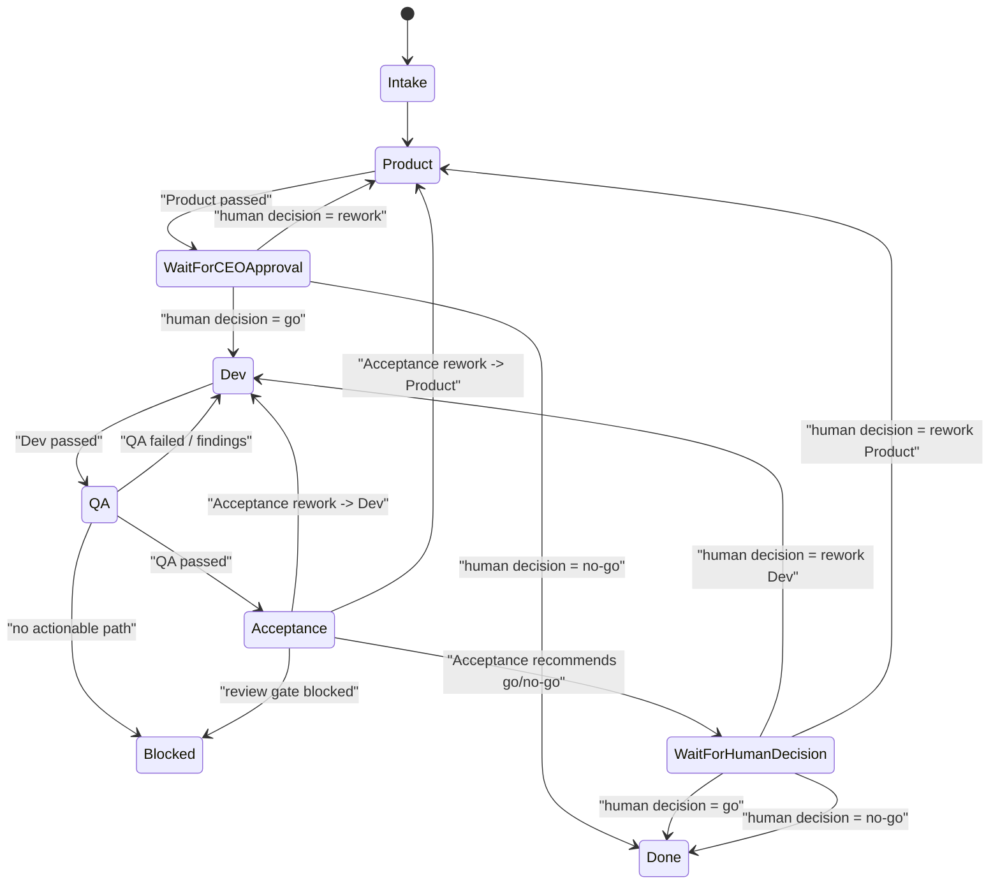
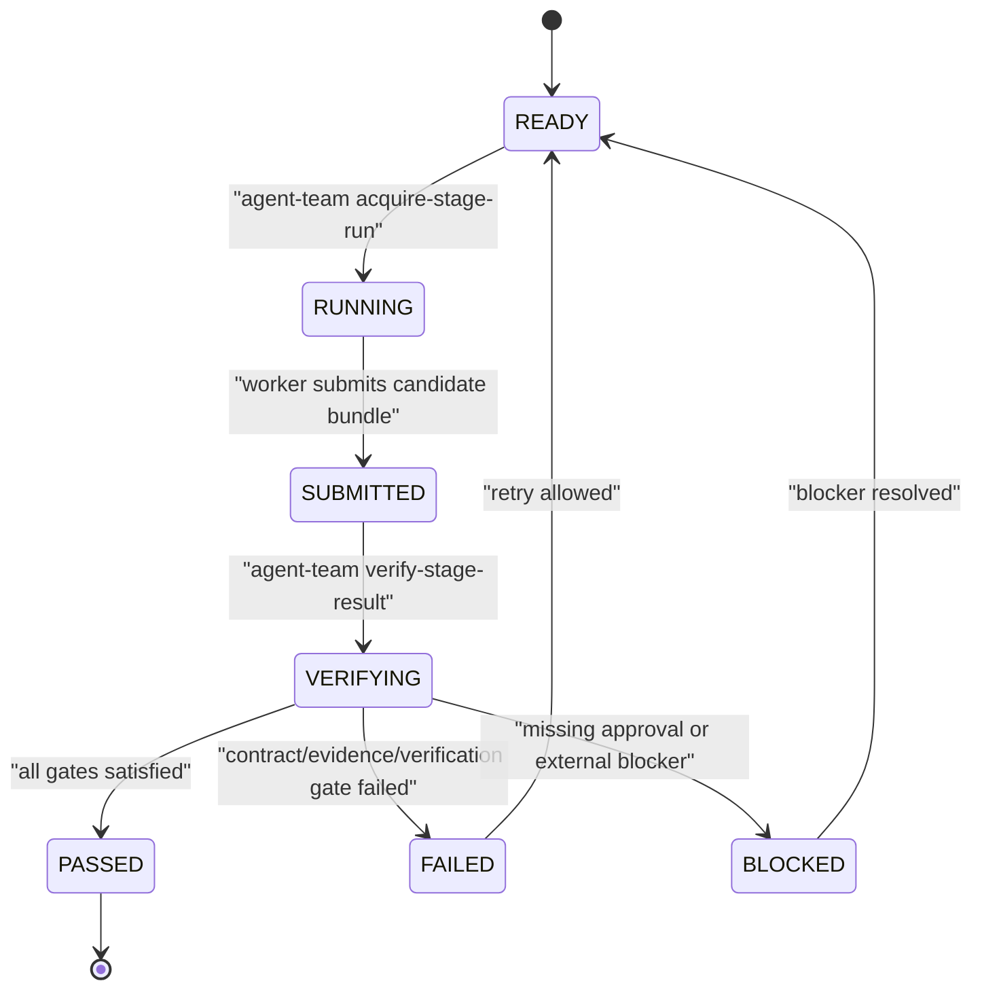
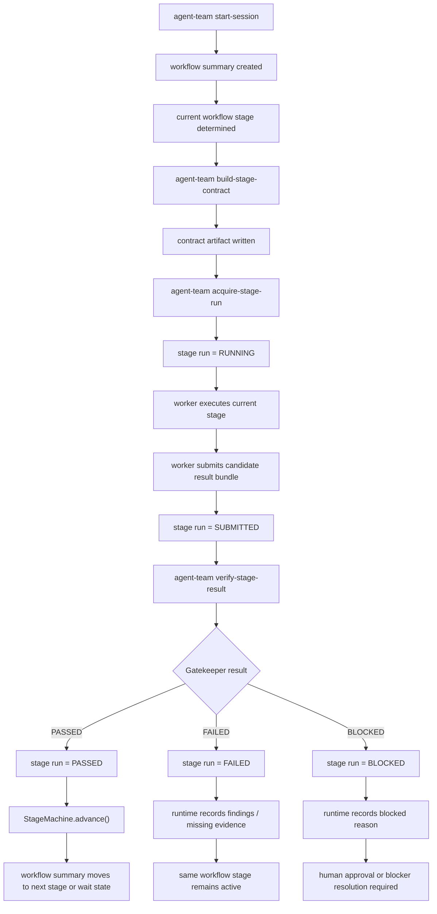

# Agent Team 强制 Stage Gate 流转图

日期：2026-04-17

## 目的

这份文档是整套强制型 runtime 流程的最短脉络图。

它主要回答四个问题：

1. 高层 workflow stage 的顺序是什么？
2. 一个可执行 stage 的内部会发生什么？
3. 谁被允许推动 workflow 前进？
4. 哪些硬性 gate 会阻止 worker 的口头声明直接变成流程事实？

## 一句话心智模型

`agent-team` 持有 workflow 状态真相，worker 只能提交候选结果，只有 runtime gatekeeper 才能把候选结果转成可通过的 stage transition。

## 第 1 层：高层 Workflow Stage 流转

这一层是业务层的流程。

它回答的是：

- 下一个该哪个团队动作
- 哪些地方必须要人工审批
- 哪些地方会发生返工回流



## 第 2 层：单个可执行 Stage Run

这一层是一个 stage 内部的技术生命周期，比如 `Product`、`Dev`、`QA`、`Acceptance`。

这正是当前 runtime 缺失的强制层，也是它比 trust-based loop 更强的关键。

这一层讲的不是整个 workflow，而是：

`当系统已经决定当前轮到某个 stage 时，这一轮 stage 执行内部到底怎么流转。`

例如当前 workflow 已经到了 `Dev`，这并不代表 Dev 已经完成。Dev 还需要走完一轮内部 run 状态：

```text
READY -> RUNNING -> SUBMITTED -> VERIFYING -> PASSED | FAILED | BLOCKED
```

这条线回答的是：

`这一次执行到底算不算真的完成？`



## 关键规则

只有当前 stage run 处于 `PASSED` 时，workflow stage 才允许前进。

这意味着：

- worker 提交结果，不等于完成
- bundle 被保存，不等于完成
- journal 里写“做完了”，不等于完成
- “我已经验证过了”，也不等于完成

只有 runtime gate 通过，才算完成。

### 每个 run state 的含义

#### `READY`

表示当前 stage 已经被 runtime 选中，允许 worker 开始执行，但还没有任何 worker 明确认领本轮任务。

可以理解成：

`轮到 Dev 了，Dev 可以开工，但还没人正式接这次任务。`

当前 CLI 实现里，`READY` 是由 `workflow_summary.md` 推导出来的可执行状态，不会单独写成一个 stage-run 文件。调用 `agent-team acquire-stage-run` 后，runtime 才会创建本轮 `stage_runs/<run_id>.json`，初始持久化状态是 `RUNNING`。

#### `RUNNING`

表示 worker 已经通过 `agent-team acquire-stage-run` 明确认领本轮 stage run，runtime 知道这次执行已经开始。

可以理解成：

`Dev 这次任务已经有人接了，正在做。`

这一步的意义是避免任何人直接绕过执行认领就提交结果。

#### `SUBMITTED`

表示 worker 已经把本轮执行结果提交回来，但这个结果只是 candidate result，不是 completion。

可以理解成：

`Dev 说：我做完了，这是我的结果，请 runtime 验收。`

注意：

`SUBMITTED != PASSED`

提交结果只是把卷子交上来，还没有判分。

#### `VERIFYING`

表示 runtime 开始验证 worker 提交的 candidate result。这个状态由 `agent-team verify-stage-result` 触发。

这一步会经过三层 gate：

- `ContractGate`：结构是否满足 contract
- `EvidenceGate`：证据是否足够证明声明
- `VerificationGate`：runtime 是否有足够信心判定通过

#### `PASSED`

表示这一次 stage run 已经通过 runtime gate。只有进入 `PASSED`，runtime 才允许调用 `StageMachine.advance()`。

可以理解成：

`这次 stage 执行本身合格，可以交给外层 workflow 状态机决定下一步。`

#### `FAILED`

表示 runtime 已经有足够信息判断：当前提交不满足要求。

典型场景：

- contract 明确要求测试输出，但 worker 没提交
- required artifact 缺失
- evidence 明显不达标
- bundle 结构不完整

可以理解成：

`worker 交卷了，但检查后不合格，打回重做。`

#### `BLOCKED`

表示 runtime 当前不能判定通过，也不一定能直接判定失败，而是验证流程被外部条件卡住。

典型场景：

- 需要人工授权
- 需要操作宿主环境
- 缺少浏览器验证工具
- 外部系统不可用
- 缺少必须由人补齐的 review artifact

可以理解成：

`不是已经判定错了，而是现在没法继续安全验证。`

### `FAILED -> READY` 和 `BLOCKED -> READY`

图里有两条回到 `READY` 的线：

```text
FAILED -> READY
BLOCKED -> READY
```

它们的含义是：

- `FAILED -> READY`：修复后可以重新开一轮 stage run
- `BLOCKED -> READY`：阻塞条件解决后可以重新开一轮 stage run

所以 `READY` 不只是第一次执行的入口，也是重试或恢复后的入口。

## 第 3 层：组合后的完整控制流

这一层是从 session 创建到进入下一 stage 的完整 control-plane 顺序。

这一层把两件事串在了一起：

- 外层 workflow：决定现在轮到谁
- 内层 stage run：决定这次执行能不能算通过

完整顺序可以理解成：

```text
agent-team start-session
-> workflow summary created
-> current workflow stage determined
-> agent-team build-stage-contract
-> contract artifact written
-> agent-team acquire-stage-run
-> stage run = RUNNING
-> worker executes current stage
-> worker submits candidate result bundle
-> stage run = SUBMITTED
-> agent-team verify-stage-result
-> Gatekeeper result
```

从 `Gatekeeper result` 开始会分成三条路：

- `PASSED`：stage run 通过，允许外层 workflow 继续流转
- `FAILED`：stage run 不合格，workflow 留在当前 stage
- `BLOCKED`：stage run 被外部条件阻塞，workflow 留在当前 stage 等人或环境恢复



### 第 3 层逐步解释

#### 1. `agent-team start-session`

创建新的 workflow session，记录用户需求，初始化 `session.json`、`workflow_summary.md` 和 request artifact。

这一刻只是流程实例存在了，还没有真正执行具体 stage。

#### 2. `current workflow stage determined`

runtime 根据 workflow summary 判断当前轮到哪个 stage。

例如：

- 刚开局一般是 `Product`
- Product 审批通过后是 `Dev`
- Dev 通过后是 `QA`
- QA 有 findings 则回 `Dev`
- QA 通过则去 `Acceptance`

这是外层 workflow 状态机在工作。

#### 3. `agent-team build-stage-contract`

runtime 给当前 stage 编译正式 contract。

contract 会告诉 worker：

- 当前 stage 是什么
- 本轮目标是什么
- 输入 artifacts 是什么
- required outputs 是什么
- evidence requirements 是什么
- forbidden actions 是什么

可以理解成：

`runtime 给当前执行者发正式任务单。`

#### 4. `agent-team acquire-stage-run`

worker 认领当前 stage run，runtime 创建 run record，并把 run state 从 `READY` 变成 `RUNNING`。

可以理解成：

`正式开工，runtime 知道这轮有人在做。`

#### 5. `worker executes current stage`

worker 按 contract 执行当前 stage：

- Product 写 PRD
- Dev 改代码并自验证
- QA 做独立验证
- Acceptance 做验收 review

runtime 在这一步不替 worker 干活，只负责等待候选结果。

#### 6. `worker submits candidate result bundle`

worker 提交本轮结果。

这里的关键词是：

`candidate result`

它只是候选结果，不是最终完成。

bundle 通常包含：

- artifact
- journal
- findings
- evidence
- summary
- contract_id

#### 7. `agent-team verify-stage-result`

runtime 开始验收这个 candidate result。

这一步是强制型 runtime 的核心，因为它把两个动作分开了：

- 交结果
- 允许推进状态

只有验证通过，提交结果才会变成流程事实。

#### 8. `Gatekeeper result = PASSED`

如果 gatekeeper 通过：

```text
Gatekeeper result = PASSED
-> stage run = PASSED
-> StageMachine.advance()
-> workflow summary moves to next stage or wait state
```

含义：

- runtime 认可这次 run 合格
- run 状态变成 `PASSED`
- 高层 workflow 才允许前进

#### 9. `Gatekeeper result = FAILED`

如果 gatekeeper 失败：

```text
Gatekeeper result = FAILED
-> stage run = FAILED
-> runtime records findings / missing evidence
-> same workflow stage remains active
```

含义：

- runtime 认为当前提交不满足要求
- run 被标记为失败
- 失败原因和缺失 evidence 被记录
- workflow 不前进，仍停在当前 stage

#### 10. `Gatekeeper result = BLOCKED`

如果 gatekeeper 被阻塞：

```text
Gatekeeper result = BLOCKED
-> stage run = BLOCKED
-> runtime records blocked reason
-> human approval or blocker resolution required
```

含义：

- 当前不是明确不合格
- 但 runtime 不能继续安全验证
- 需要外部条件补齐
- workflow 不前进，等人处理或环境恢复

## 谁拥有什么权力

### Runtime 负责

- 当前 workflow stage
- stage contract 真相
- 当前 active run 身份
- gate 评估
- transition eligibility
- wait state
- human decision 记录

### Worker 负责

- 执行当前 contract
- 产出 artifacts
- 产出 evidence
- 提交 candidate result

### Human 负责

- Product 之后的 CEO 式审批
- Acceptance 之后最终的 Go/No-Go
- 对被 blocked 的 host-environment change 做显式批准

## 硬性 Gate

gatekeeper 应该评估三层。

### 1. ContractGate

检查：

- stage 是否匹配当前预期 stage
- `contract_id` 是否匹配
- required outputs 是否存在
- forbidden actions 是否被违反

如果这层失败，说明 worker 没满足结构性 contract。

### 2. EvidenceGate

检查：

- required evidence 是否存在
- evidence 是否足够 machine-readable
- stage-specific evidence 规则是否满足

如果这层失败，说明 worker 还没有证明自己的声明。

### 3. VerificationGate

检查：

- 需要的 review completion artifacts 是否存在
- environment mutation policy 是否被遵守
- 可选 recheck 或 evidence sanity check 是否通过

如果这层失败，说明 runtime 还不够有信心把这个 stage 当成 passed。

## 各 Stage 的预期

### Product

必须证明：

- PRD 存在
- acceptance criteria 明确
- contract 要求的产品 artifacts 已经存在

不能做：

- 跳过人工审批

### Dev

必须证明：

- implementation artifact 存在
- self-verification evidence 存在
- contract 要求的 command 或 artifact evidence 已经附上

典型 evidence：

- test output
- typecheck output
- lint output
- diff 或 commit summary

### QA

必须证明：

- independent verification 确实发生了
- findings 要么明确为空，要么明确列出

QA 不能仅因为 Dev 说“通过了”就给通过。

### Acceptance

必须证明：

- acceptance criteria coverage 是显式的
- required review artifacts 存在
- review-completion gate 通过

Acceptance 可以给出推荐，但不能自己终结 workflow。

## 命令层视角

这是期望中的 CLI 顺序。

```text
agent-team start-session
-> agent-team step
-> agent-team build-stage-contract
-> agent-team acquire-stage-run
-> worker executes stage
-> agent-team submit-stage-result
-> agent-team verify-stage-result
-> agent-team step
```

如果 workflow 进入 wait state：

```text
agent-team record-human-decision
-> agent-team step
```

实现上的关键点：

- `acquire-stage-run` 会创建 active run lock，防止绕过认领直接提交。
- `step` 会打印当前 `contract_id`、`required_outputs` 和 `required_evidence`，让操作者知道下一步需要满足的硬约束。
- `submit-stage-result` 只把 bundle 保存成 candidate result，并把 run 置为 `SUBMITTED`。
- `verify-stage-result` 才会调用 gatekeeper。gatekeeper 会按 `evidence_specs` 检查结构化 evidence 的 `name`、`kind` 和必填字段。
- 只有 gatekeeper 返回 `PASSED` 时，runtime 才调用 `StageMachine.advance()`。
- `FAILED` 和 `BLOCKED` 都不会推进 workflow；下一轮需要重新 `acquire-stage-run`。

## 例子：Dev 到 QA

这是最简单的 happy path。

```text
workflow stage = Dev
stage run state = READY

1. acquire-stage-run
2. stage run -> RUNNING
3. worker implements and submits candidate result
4. stage run -> SUBMITTED
5. verify-stage-result
6. gatekeeper checks outputs and evidence
7. gate passes
8. stage run -> PASSED
9. StageMachine.advance()
10. workflow stage -> QA
11. next QA stage run starts at READY
```

## 例子：QA 发现回归问题

```text
workflow stage = QA
stage run state = READY

1. acquire-stage-run
2. QA executes independent verification
3. QA submits candidate result with findings
4. verify-stage-result
5. gate passes structurally because QA did its job correctly
6. stage run -> PASSED
7. StageMachine.advance() interprets findings
8. workflow stage routes back to Dev
```

这里有一个关键区别：

- QA 这个 stage run 可以 pass
- 但 workflow 依然可以被路由回 Dev

因为这里的含义是：QA 这次执行本身是合格的，它成功产出了一个有效的验证结果；只是这个结果说明产品还不能继续往前走。

## 例子：Acceptance 因缺少 Review Evidence 被阻塞

```text
workflow stage = Acceptance
stage run state = READY

1. acquire-stage-run
2. Acceptance performs review
3. candidate result is submitted without required review evidence
4. verify-stage-result
5. EvidenceGate or VerificationGate fails
6. stage run -> BLOCKED
7. workflow stage does not advance
8. runtime records blocked reason
9. human approval or missing artifact resolution is required
```

## 关键区分：Run Pass 和 Workflow Advance

这里有两种不同的“pass”：

### Stage run passed

表示当前 executor 满足了这一次 stage attempt 的 runtime contract。

### Workflow advanced

表示整个 workflow 被允许合法地进入下一个业务阶段。

通常：

- `run PASSED` 是 workflow 前进的前置条件

但 workflow 下一步去哪里，仍然取决于 stage 语义：

- QA run 即使 pass，也可能因为 findings 存在而把 workflow 路由回 Dev
- Acceptance run 即使 pass，也可能把 workflow 路由到 `WaitForHumanDecision`

### 两层状态机如何配合

整套系统里有两条状态线同时存在。

#### 第 1 条线：Workflow Stage

它回答的是：

`现在轮到谁？`

例如：

```text
Intake
-> Product
-> WaitForCEOApproval
-> Dev
-> QA
-> Acceptance
-> WaitForHumanDecision
-> Done
```

#### 第 2 条线：Stage Run

它回答的是：

`这一次执行到底算不算合格？`

例如当前 workflow stage 是 `Dev`，那么 Dev 这一轮内部会走：

```text
READY
-> RUNNING
-> SUBMITTED
-> VERIFYING
-> PASSED / FAILED / BLOCKED
```

#### 两条线的配合规则

```text
run PASSED -> workflow 才允许前进
run FAILED -> workflow 不前进，当前 stage 重试
run BLOCKED -> workflow 不前进，等待阻塞条件解决
```

### 几个典型流转

#### 正常通过

```text
workflow = Dev
run = READY
-> RUNNING
-> SUBMITTED
-> VERIFYING
-> PASSED
-> workflow 前进到 QA
-> QA 的新 run 从 READY 开始
```

#### 执行失败

```text
workflow = Dev
run = READY
-> RUNNING
-> SUBMITTED
-> VERIFYING
-> FAILED
-> workflow 还是 Dev
-> 下一次 Dev run 再从 READY 开始
```

#### 执行被阻塞

```text
workflow = Acceptance
run = READY
-> RUNNING
-> SUBMITTED
-> VERIFYING
-> BLOCKED
-> workflow 还是 Acceptance
-> 等人补条件
-> 再从 READY 开始下一轮
```

#### QA run 通过，但 workflow 回 Dev

```text
workflow = QA
run = READY
-> RUNNING
-> SUBMITTED
-> VERIFYING
-> PASSED
-> StageMachine.advance()
-> 因为 findings 存在，workflow 路由回 Dev
```

这里最关键的是：

`run pass != 产品 pass`

QA run pass 的意思是：QA 这次验证工作做得合格。  
workflow 回 Dev 的意思是：QA 的验证结果发现产品还不能继续往前。

## 为什么这比 Ralph 式 Loop 更强

在 Ralph 式 loop 里，worker 往往会：

- 自己选择下一个任务
- 自己执行
- 自己判断是不是完成
- 自己更新状态文件

而在这个 enforced model 里：

- runtime 选择当前 active stage
- runtime 编译 contract
- worker 只产出 candidate result
- runtime 验证 candidate result
- 只有 runtime 才能推进 workflow

这就是核心的工程升级点。

## 推荐阅读顺序

如果你想快速理解整个系统，建议按这个顺序看：

1. 先看这份 flow 文档，理解整体脉络
2. 再看 [2026-04-17-agent-team-enforced-stage-gates-design.md](/Users/zhoukailian/Desktop/mySelf/agent-team-runtime/docs/superpowers/specs/2026-04-17-agent-team-enforced-stage-gates-design.md)，理解详细设计
3. 最后对照 [2026-04-11-agent-team-cli-runtime-flow.md](/Users/zhoukailian/Desktop/mySelf/agent-team-runtime/docs/workflow-specs/2026-04-11-agent-team-cli-runtime-flow.md)，看当前实现在哪里还偏弱

## 最终心智模型

记住这一句话就够了：

`worker 负责执行，runtime 负责验证，只有 gate 通过后状态才前进`
