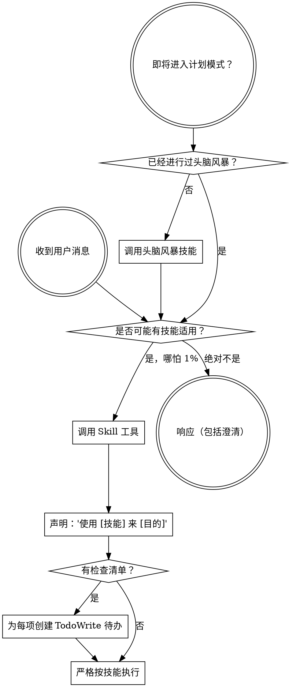

<SUBAGENT-STOP>
如果你是作为子代理被派遣执行特定任务，请跳过此技能。
</SUBAGENT-STOP>

<EXTREMELY-IMPORTANT>
如果你认为某个技能有哪怕 1% 的可能适用于你正在做的事情，你就必须调用该技能。

如果某个技能适用于你的任务，你别无选择，必须使用它。

这不可谈判。这不是可选的。你无法用理由说服自己绕过这一点。
</EXTREMELY-IMPORTANT>

## 指令优先级

Superpowers 技能会覆盖默认系统提示的行为，但**用户指令始终优先**：

1. **用户的明确指令**（CLAUDE.md、GEMINI.md、AGENTS.md、直接请求）——最高优先级
2. **Superpowers 技能**——在冲突时覆盖默认系统行为
3. **默认系统提示**——最低优先级

如果 CLAUDE.md、GEMINI.md 或 AGENTS.md 说"不要使用 TDD"，而某个技能说"始终使用 TDD"，则遵从用户的指令。用户拥有控制权。

## 如何访问技能

**在 Claude Code 中：** 使用 `Skill` 工具。当你调用一个技能时，其内容会被加载并呈现给你——直接按照它执行。不要对技能文件使用 Read 工具。

**在 Gemini CLI 中：** 技能通过 `activate_skill` 工具激活。Gemini 在会话开始时加载技能元数据，并按需激活完整内容。

**在其他环境中：** 查阅你所在平台的文档，了解技能的加载方式。

## 平台适配

技能使用 Claude Code 的工具名称。非 CC 平台请参阅 `references/codex-tools.md`（Codex）获取等效工具映射。Gemini CLI 用户通过 GEMINI.md 自动获得工具映射。

# 使用技能

## 规则

**在任何响应或操作之前，先调用相关或被请求的技能。** 即使只有 1% 的可能性技能适用，你也应该调用它来确认。如果调用后发现技能与情况不符，则无需使用它。

## 警示信号

出现以下想法意味着停下——你正在为自己找借口：

| 想法 | 现实 |
|------|------|
| "这只是个简单问题" | 问题也是任务。检查技能。 |
| "我需要更多上下文" | 技能检查在澄清性问题之前进行。 |
| "让我先探索一下代码库" | 技能告诉你如何探索。先检查。 |
| "我可以快速看看 git/文件" | 文件缺少对话上下文。检查技能。 |
| "让我先收集一些信息" | 技能告诉你如何收集信息。 |
| "这不需要正式的技能" | 如果技能存在，就使用它。 |
| "我记得这个技能" | 技能在不断演进。阅读当前版本。 |
| "这不算是一个任务" | 行动 = 任务。检查技能。 |
| "这个技能太重了" | 简单的事情会变复杂。使用它。 |
| "让我先做这一件事" | 在做任何事之前先检查。 |
| "这感觉很有效率" | 无纪律的行动浪费时间。技能能防止这种情况。 |
| "我知道那是什么意思" | 了解概念 ≠ 使用技能。调用它。 |

## 技能优先级

当多个技能可能适用时，按以下顺序使用：

1. **流程技能优先**（头脑风暴、调试）——这些决定了如何处理任务
2. **实现技能其次**（frontend-design、mcp-builder）——这些指导执行

"我们来构建 X" → 先头脑风暴，然后是实现技能。
"修复这个 bug" → 先调试，然后是特定领域技能。

## 技能类型

**刚性**（TDD、调试）：严格遵循。不要偏离纪律。

**灵活**（模式）：根据上下文调整原则。

技能本身会告诉你它属于哪种类型。

## 用户指令

指令说明做什么，而不是怎么做。"添加 X"或"修复 Y"不意味着跳过工作流程。
